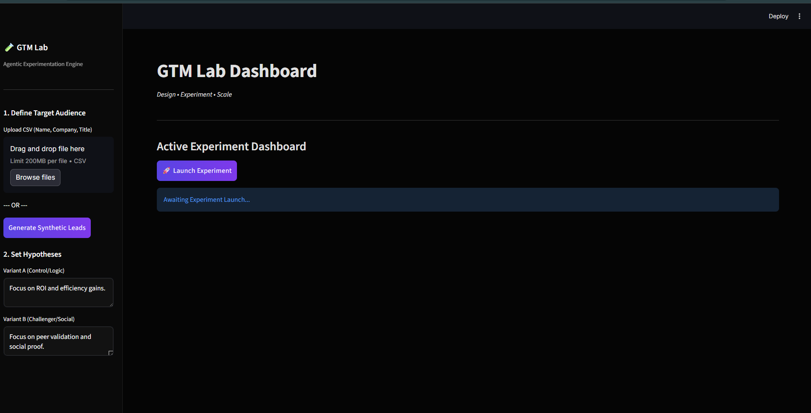
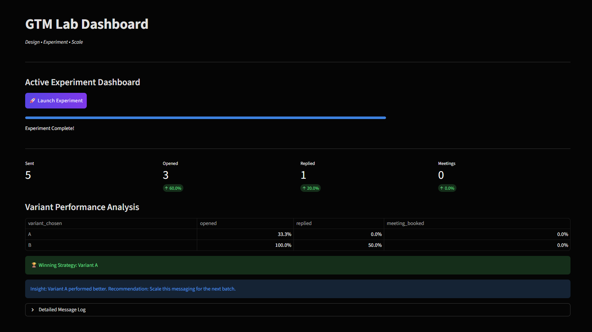
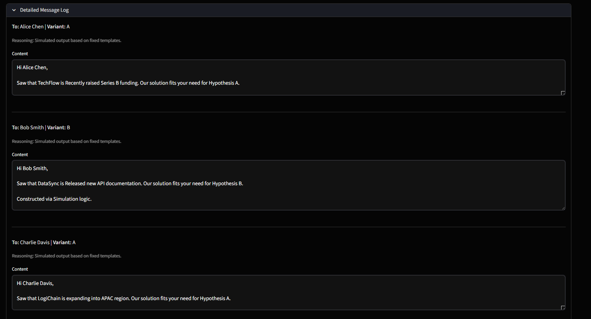

# AI-Assisted GTM Experimentation System (V2.0)

An AI-assisted outbound experimentation system that generates personalized messaging variants and simulates B2B funnel performance.

🚀 [Live Demo](https://ai-assisted-gtm-experimentation.streamlit.app/)

📂 [GitHub Repository](https://github.com/yashrajdesaii/ai-assisted-gtm-experimentation)

## Features
- **Project Structure**: Modular architecture separating UI logic from core business logic.
- **Agentic Workflow**:
    - **Researcher Agent**: Identifies "triggers" (funding, hiring) to personalize outreach.
    - **Strategist Agent**: Generates A/B message variants based on specific hypotheses.
- **Simulation Engine**: Probabilistic model to estimate open/reply rates based on message quality and fit.
- **Analytics Dashboard**: Real-time experiment tracking and "winning variant" identification.

## Demo Screenshots

### 1) Dashboard


### 2) Results & Variant Analysis


### 3) Generated Outreach Examples



## Setup

1.  **Install Dependencies**:
    ```bash
    pip install -r requirements.txt
    ```

2.  **Configure API Keys**:
    Create a `.env` file or set environment variables:
    ```bash
    export OPENAI_API_KEY="your-key-here"
    # OR
    export ANTHROPIC_API_KEY="your-key-here"
    ```
    *(The system will use a simulation mode if no keys are found)*

3.  **Run the Application**:
    ```bash
    streamlit run src/ui/app.py
    ```

## Usage
1.  **Define Leads**: Upload a CSV or use the "Generate Synthetic Leads" button.
2.  **Configure Experiment**: Define your hypothesis for Variant A (e.g., ROI-focused) vs Variant B (e.g., Social Proof).
3.  **Launch**: Click "Launch Experiment" to watch the agents work.
4.  **Analyze**: Review the funnel metrics and strategy recommendations.

## Directory Structure
-   `src/core`: Backend logic (Agents, Models, Simulator).
-   `src/ui`: Streamlit frontend application.
-   `data`: (Optional) Store CSV files here.
